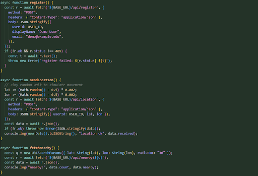
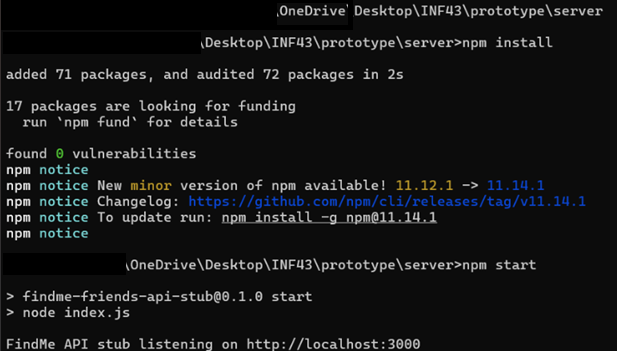
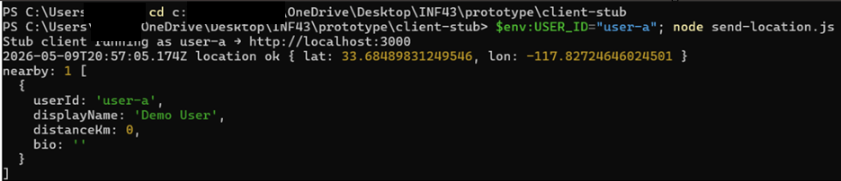
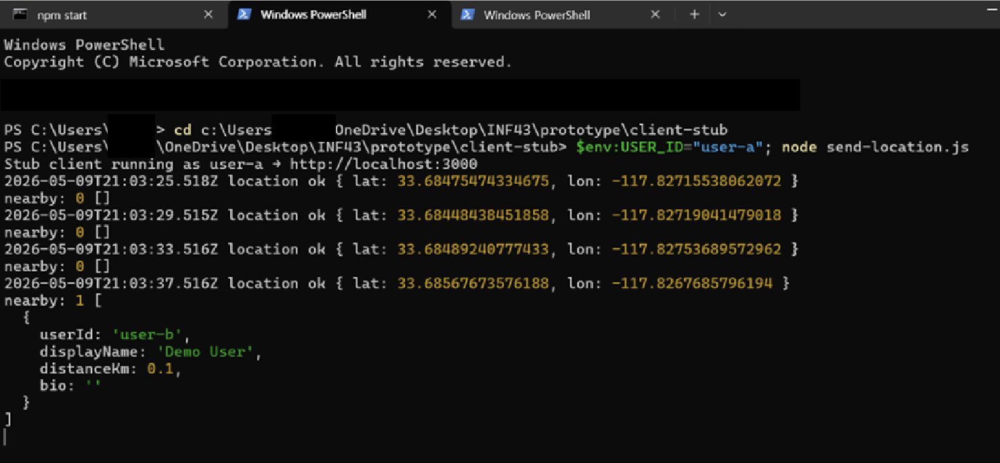

# HW2: Architecture

### Group: Keya Negandhi (KNEGANDH), Makani Melendrez (MAKANIM), Anirudh Ravishankar(aravish4), Jungmin Han(jungmih1), Daniel Tan (dmtan2)

## Architectural Summary:

## Platforms
The platforms that we using are:
### 1. Android
Coding Language: Expo React Native

Part: Mobile App

This is our main platform, because all types of platforms can test an android environment. 

- **Benefits:** The benefits of using react is that the platform will respond quickly, and can conform with IOS applications later.

- **Tradeoffs:** For configuration, we cannot just use react, we will have to use APIs which cause more components that need to be hidden by abstraction.

### 2. Linux
Coding Language: PaaS + Node.js

Part: server

- **Benefits:** Can use JSON when it comes to connecting APIs which makes it easier to load data in a set formatted way. Most of us are learning how to iterate data of JSON from APIs in ICS H32, so we are most familiar with it.

- **Tradeoffs:** The CPU is doing a lot of the work, so users' phones/computers could heat up, the application can be slower, etc. 
### 3. Vendor SDK and HTTPS API

Part: Maps

- **Benefits:** This is a reliable way to receive geolocation and have an accurate map.

- **Tradeoffs:** Expensive, privacy concerns, and some parts of this can only be accessed by android, so if we wanted to expand to IOS it would be harder.
### 4. SQL
Part: Data

- **Benefits:** Can query easily and it will not bug out over time.

- **Tradeoffs:** Backups can be difficult to perform.

## Programming Languages
The programming languages that we are choosing to use are:

### 1. React Native and React in combination

The role of react will be for the UI/UX design

- **Benefits:**: React supports reusability. The type of user interface this would be is declarative, meaning we get to focus on what it should look like before we focus on the how. This is something that we learned in Informatics 43. 

- **Tradeoffs:** Connecting modules in React Native is harder than other languages, so it might be tedious. Additionally, code may need to be edited a good amount and that could cause bugs.

### 2. Node.js

The role of node is to use it as an API, specifically HTTP. It would be public.

- **Benefits:** React and node would be used for the frontend, giving more flexibility.

- **Tradeoffs:** More errors, and need to ensure there are authentication/privacy protocols that are covered when receiving data from the API.

### 3. Python

The role of this is to give us more flexibility with services. For example we have more geolocation helpers.

- **Benefits:** Very large library for geolocation as well as helps with asynchronous activity.

- **Tradeoffs:** Clashes with nodes because they both have different interface agreements as well as how they run code.

## Communication Protocols
### 1. From the Mobile App to the API Server

- Will use HTTPS with JSON request bodies.
- This will help with protecting the information that is sent as HTTPS allows us to encrypt messages between parts of the system allowing for greater security.
- This is extremely valuable especially considering that our app will rely on users giving the app their ID and passwords to verify their identity.
- JSON works perfectly well with our other parts which will be using React Native and Node.js, since it's compatible and easy to read.

The type of information that will be sent will be:
- **Login and registration request:** Username, password hash, email, and the ID image

- **Location updates:** The users current location sent periodically via their longitude and latitude

- **Chat Messages:** Sender ID, Recipient ID and message content

- **Profile changes:** Bio text, public/private setting, and the filter settings

- **Activity request:** Join, create, view local group activity, includes the location, name, time

### 2. From API Server to SQL Database

- The pattern in which we will send and receive data from our SQL database is via CRUD/SQL commands, which stand for (Create, Read, Update and Delete).
- Every entity in our app would map to a table such as a table for users, events and chats and the server would interact with the tables through SQL commands.

Process of using each command:
- **Create:** Initially there would be a table created for the entity with the first couple of people that register for the app. When new users register then a new row would be added with their information on it in the Users table.

- **Read:** An example of this implementation would be when a user opens up their chat tab, then when they do the API server would query the database for that user's chat  history and that is how it would populate the chat.

- **Update:** When a user edits their bio, their public/private setting, or changes their filter then the row in the users table would be updated for the corresponding individual.

- **Delete:** When a user deletes their account, then we would simply delete their row on all of the tables that they are associated with.

### 3. From the API Server to the maps SDK (Google Maps)
- The server uses HTTPS to communicate with the third-party maps provider.

- The process is as follows where the server sends a combination of the longitude and latitude of the user's current location, and receives the map tile data or geocoded location info from the SDK.

- The mobile app is able to render the map on the app by communicating with the SDK as well but mainly we try to send location info for other users within the current users area through our server API to the SDK for that extra encryption protection.

### 4. From the API Server to the ID verification service
1. As the user is registering for their account and they have to verify their identity then they would upload a photo of a government-issued ID.

2. This photo is then sent by the server to a third party ID verification service.

3. This message is through most often the form of HTTPS POST, which is what we will  be using.

4. Once the server receives the message then it either verifies the users identity by verifying that their ID and name match or it sends a message back of denial.

5. Depending on the acceptance or denial, the server allows the user to continue or blocks them from registering.

## Examples of Component Functions and Connector Communications

## Prototype Implementation

- I prompted Cursor to use all of the requirements specification, design decisions made from this week, and other directions from the instructor to come up with a very simple prototype for our app.
- The prototype uses Node.json files in order to simulate a server and its clients on different terminals.
- Here are some of the most basic functions that were written in this prototype:

1. register() simply sends the userId, displayName, and email to the server, and the server takes these information to create an entry in the “users” map. 

2. The current implementation of sendLocation() uses random functions to change the user’s location by a small bit to simulate movement, then sends the location variables lat and lon paired with userId to the server. The server then finds that user within its map and overwrites the user’s location. 

3. fetchNearby() builds a query with a single entry of location and radius, and compares the information with each of the users. 

4. A challenge that arises with this design is that each fetchNearby loop will complete a sequential search with the entire user database, which has a O-notation of O(N) and is suboptimal for a realistic, scalable implementation of a mobile app with potentially thousands of users. However, this is a simplified prototype stub that is mostly designed for us to learn the process of building an app. It still does its job, and will have to suffice for our current expectations.

With a few different packages and .js files that include these functions, I have managed to create a local simulation of our server-client communication on my environment.

Another challenge from this prototype was that upon registration of the first user, the server-side comparison didn’t actually differentiate the client from other user users. As a result, as seen above, a single registration resulted in a loop falsely reporting that there was a nearby user. I fixed this issue by assuming every userId was unique, and adding a simple comparison with these ids.

This is a screenshot of one of the client terminals after making these changes. When user-a is inputted into this terminal, and user-a is the only user on our database, the loop fetches noone and reports nearby as 0. After opening another terminal and creating a user-b, the loop responds to this change by fetching the other user.

This is a very basic implementation for the prototype and is missing most of the functionalities that are specified in our requirements specification. However, we were able to familiarize ourselves with the server-client communication mechanisms and the language that we will be using. The issues and design decisions that arose throughout this prototype will be beneficial in how we proceed with our app development.
